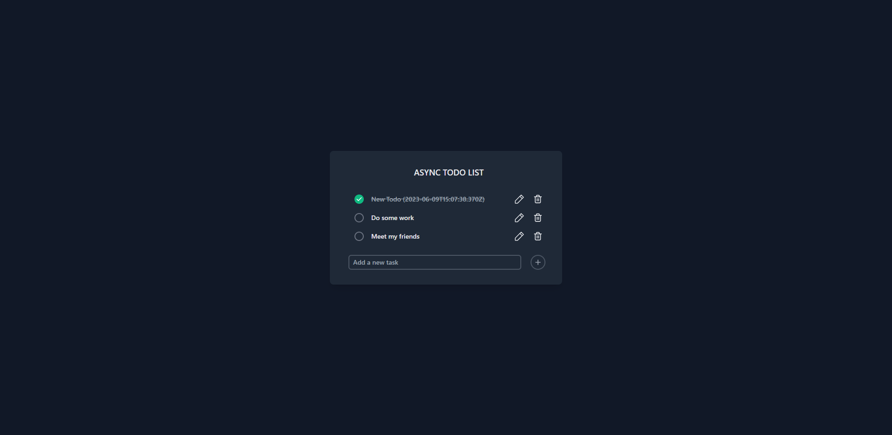
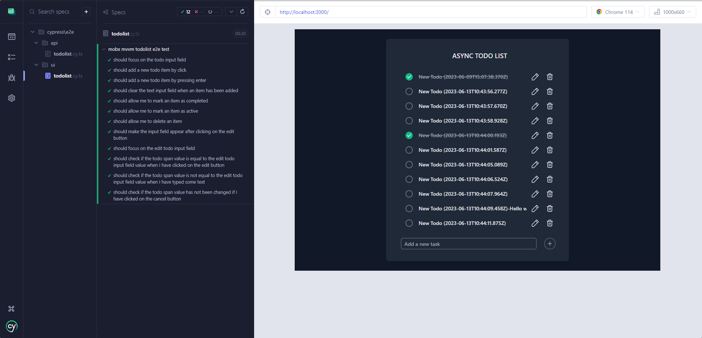
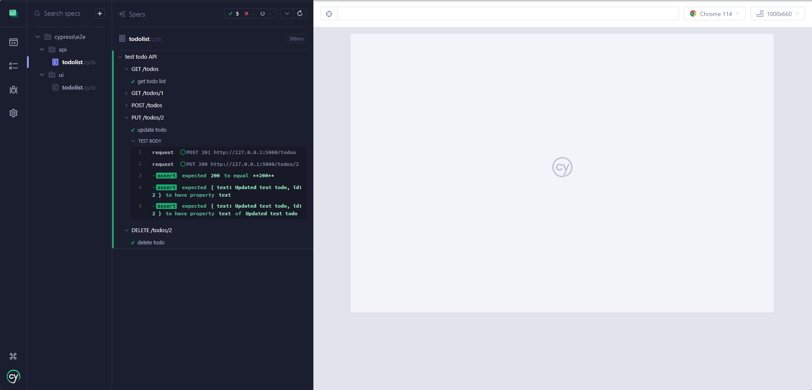

# Simple react/typescript todolist app with mobx-mvvm architecture, tailwind css and cypress tests

React MVVM architecture is powered by MobX. Workspace uses Parcel build tool.

## The principles of MVVM

* The ViewModel(VM) should not depend on React and should have no idea what the view looks like.
* With the correct implementation of MVVM architecture, the View should be decoupled from the underlying data and business logic.
* The pure VM is much easier to test than react components with state logic.
* VMs should be light & cheap and easily re-implemented with the same interface the view uses.

## Backend

In order to run the fake backend please install the [JSON Server](https://github.com/typicode/json-server) via

```bash
yarn global add json-server
```

Then,

```bash
yarn run start-server
```

And finally,

```bash
yarn run start
```

## Cypress

This repo contains the tests written in Cypress.

| Type | Location                                 |
| ---- | ---------------------------------------- |
| api  | [cypress/tests/api](./cypress/tests/api) |
| ui   | [cypress/tests/ui](./cypress/tests/ui)   |

Run 

```bash
yarn run cypress:open
```
 to launch the cypress test runner in the interactive watch mode.

## App Screenshot



## Tests Screenshots





## Tech Stack

React, Typescript, Mobx, MVVM, Tailwind CSS, Cypress, Parcel

## License

[MIT](./LICENSE)